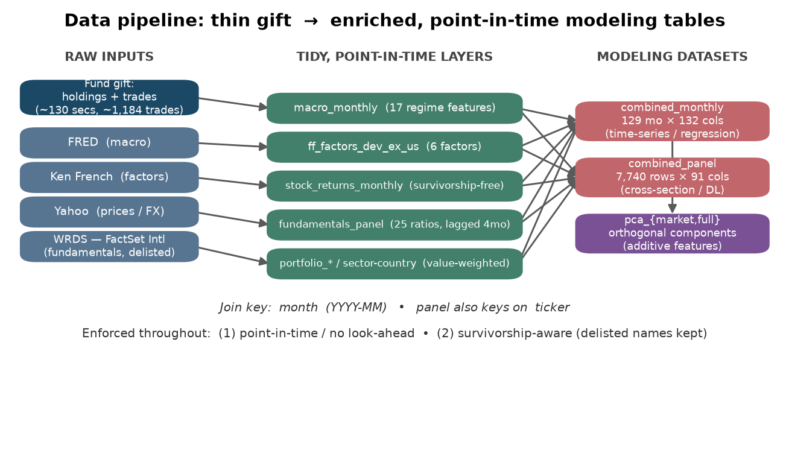
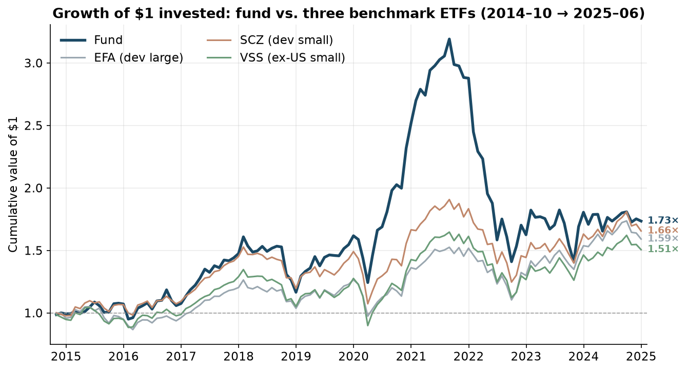
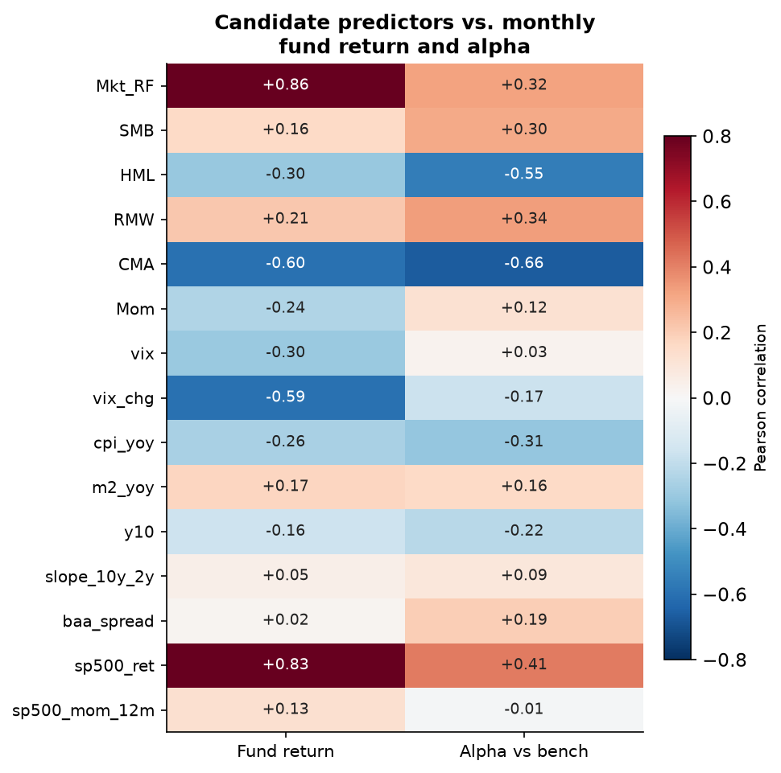
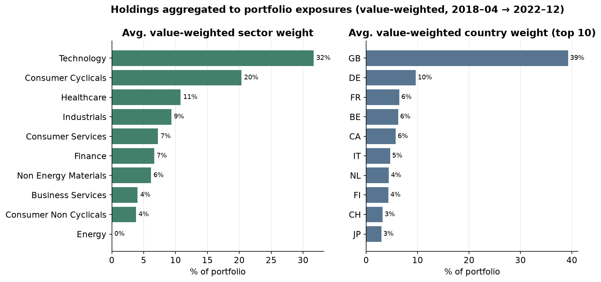
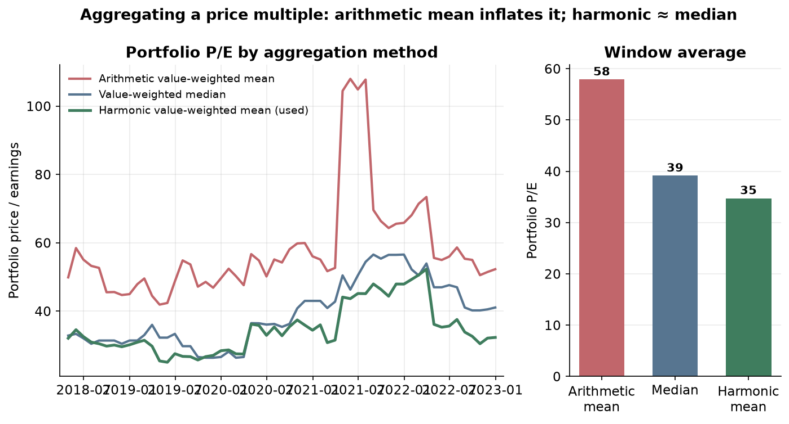
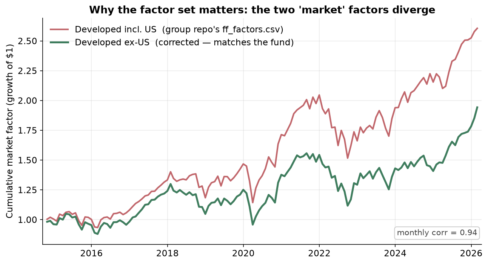

# Data Processing & Aggregation

*Checkpoint section — the Fund capstone*

## 1. Starting point and objective

The fund is a developed-markets **ex-US small/mid-cap** equity fund, benchmarked against three
ETFs — **EFA** (developed large-cap), **SCZ** (developed small-cap), and **VSS** (ex-US small-cap).
Our goal is to (1) **explain** the fund's performance and (2) **build models that predict it**.

The data we were given was thin: **holdings and trades only** — roughly **130 securities** and
**1,184 trades** spanning **2018-04 → 2022-12**. There were no returns, no risk factors, no macro
context, and no company fundamentals. Almost all of the data work has therefore been **enrichment**:
sourcing returns, Fama–French risk factors, macro regime indicators, and company fundamentals, then
**aggregating** them into clean, modeling-ready tables keyed on a common monthly index.

## 2. The data-processing pipeline

We built the enrichment in a separate pipeline repository under one rule: *external sources →
tidy, point-in-time, month-keyed tables*. Each external source is processed by its own module into
a tidy intermediate layer; those layers are then joined into two final modeling datasets, with an
additive PCA feature set layered on top.

**Figure 1.** The pipeline. The raw gift (holdings + trades) plus four external sources — **FRED**
(macro), **Ken French** (factors), **Yahoo** (prices/FX), and **WRDS / FactSet International**
(fundamentals, including delisted names) — are each cleaned into tidy point-in-time layers, then
joined on `month` into two analysis-ready tables: **`combined_monthly`** (129 months × 132 columns,
for time-series/regression work) and **`combined_panel`** (7,740 rows = 129 holdings × 60 months ×
91 columns, for cross-sectional / deep-learning work). The PCA feature set is *additive* — it sits
beside the originals, never replaces them. Two principles are enforced in code throughout:
**point-in-time / no look-ahead** and **survivorship-awareness** (delisted names are kept, not
dropped).

Two windows result, and they matter for modeling. **Returns, factors, and macro** span the full
**2014-10 → 2025-06** (129 months). **Fundamentals and sector/country exposures** exist only for the
**holdings window, 2018-04 → 2022-12** (57 months), because we only know what the fund held during
the years it gave us trades.

## 3. What we are modeling — the target

**Figure 2.** Growth of $1 invested in the fund versus the three benchmark ETFs, built from the
monthly return series we sourced (the modeling target). The fund (dark line) compounds to **~2.16×**
over the window, ahead of **EFA (~1.85×)** and well ahead of the small-cap benchmarks
**SCZ (~0.90×)** and **VSS (~0.80×)**, which actually end *below* their starting value. The fund's
edge is concentrated in a strong **2017–2021** run that peaks near 3.2× in late 2021, followed by a
sharp 2022 drawdown shared with the benchmarks. This is the behaviour our models must explain and
predict: substantial **outperformance**, but lumpy and regime-dependent — which is what motivates the
macro, factor, and fundamental predictors below.

## 4. Potential predictor variables and methods

Enrichment produced four families of candidate predictors, all aligned to the monthly index:

| Predictor family | Count | Examples | Source / method |
|---|---|---|---|
| **Fama–French factors** (Developed ex-US) | 6 | `Mkt_RF, SMB, HML, RMW, CMA, Mom` | Ken French Data Library; correct ex-US region (see §5) |
| **Macro regime indicators** | 17 | `vix, vix_chg, cpi_yoy, core_pce_yoy, m2_yoy, y10, slope_10y_2y, baa_spread, sp500_ret, sp500_mom_12m` | FRED + Yahoo; resampled to month-end; releases lagged 1 month |
| **Portfolio fundamentals** (2018–2022) | 25 ratios | P/E, P/B, ROIC, EBIT margin, debt/equity, Altman Z, sales/EPS growth | FactSet International, value-weighted to the portfolio |
| **Sector & country exposures** (2018–2022) | 10 + 24 | `sect_wt_healthcare`, `ctry_wt_FR`, plus HHI concentration | FactSet RBICS sector + entity domicile, value-weighted |
| **PCA components** (engineered) | 23 (market) / 48 (full) | `PC1…PCk` | Standardized SVD on the above; additive (originals retained) |

We use these in two model framings. For **time-series / rolling regression**, the monthly table
regresses fund return (and **alpha** vs the benchmark average) on factors and macro. For
**cross-sectional / deep-learning**, the panel predicts each holding's **`next_ret`** from its own
fundamentals plus broadcast factors/macro and one-hot country/sector dummies.

**Figure 5.** Pearson correlation of each candidate macro/factor predictor with the monthly **fund
return** and with **alpha** (fund minus benchmark average). It is a quick read on signal strength and
sign. The market factor **`Mkt_RF` (+0.86)** and US equity returns **`sp500_ret` (+0.81)** dominate —
the fund is, first and foremost, long equity beta. Beyond beta, the strongest signals are
**risk-off** variables: a *rising* VIX (`vix_chg`, **−0.59**) and the conservative-investment factor
**`CMA` (−0.58)** both move against the fund. Notably the alpha column carries non-trivial loadings
(e.g. `vix_chg` **−0.63**), which is encouraging — it suggests there is regime-linked structure in the
fund's *excess* return, not just its raw return, for the predictive models to learn.

## 5. Data aggregation — methods and justification

Aggregation is where most of the judgment lives. Four decisions are worth calling out.

### 5.1 Holdings → portfolio exposures (value-weighted)

Per-holding sector, country, and fundamental values are rolled up to the **portfolio** level using
**value weights** (shares × FactSet price × FX), recomputed each month so the weights track the
fund's actual evolving positions.

**Figure 4.** The average value-weighted sector (left) and country (right) composition over the
holdings window. The aggregation surfaces a clear portfolio identity: it is **Healthcare- (33%) and
Technology-heavy (23%)**, with Industrials and Consumer Cyclicals next (~13% each), and is
geographically concentrated in **France (29%)** and the **UK (21%)**, then Norway and Japan (~9%
each). This justifies why we aggregate rather than model 130 stocks independently — the fund behaves
like a *concentrated growth-sector, Europe-tilted* book, and those tilts are themselves predictors.

### 5.2 Price multiples → harmonic mean (not arithmetic)

For the six **price multiples** (P/E, P/B, P/Sales, P/FCF, EV/EBITDA, EV/Sales), a value-weighted
**arithmetic** mean is the *wrong* aggregator: a single near-zero-earnings holding sends its P/E to
hundreds and drags the portfolio average up with it. The correct portfolio multiple is the
**value-weighted harmonic mean** (= aggregate price ÷ aggregate earnings).

**Figure 3.** Portfolio P/E computed three ways, over time (left) and on average (right). The
**arithmetic** mean (red) is persistently inflated — it averages **~51** and spikes near 95 in
2021 — while the **harmonic** mean we use (green, ~35) sits close to the value-weighted **median**
(blue, ~39), which is an independent robustness check. The arithmetic series isn't just higher; it is
*differently shaped* (those denominator-driven spikes are artefacts), which would mislead any model.
We additionally **winsorize each ratio cross-sectionally at [5%, 95%]** before weighting, so extreme
single-name values can't distort the aggregate. The non-multiple ratios (yields, margins, growth,
quality scores) aggregate correctly as ordinary value-weighted means.

### 5.3 The right factor universe (a data-correctness fix)

The fund is **ex-US**, so its market factor must be too. We verified that the factor file circulating
in the modeling repo is actually Ken French's **Developed *including* US** set (an exact fingerprint
match), not the Developed-ex-US set the fund requires. We replaced it with the correct
**Developed-ex-US** factors.

**Figure 6.** Cumulative growth of the two candidate "market" factors over the fund era. They still
co-move month-to-month (corr ≈ 0.94 in this window), but their **levels diverge sharply** — the
incl-US factor compounds to **~2.6×** versus **~1.95×** ex-US, because it carries ~60% US market
exposure the fund never held. Regressing an ex-US fund on an incl-US market factor contaminates every
beta and alpha estimate, so this correction is a prerequisite for the performance-attribution work,
not a cosmetic detail.

### 5.4 PCA — additive, interpretable feature engineering

Many predictors are collinear (the macro and factor blocks especially). We add a **standardized,
SVD-based PCA** that z-scores the features and rotates them into orthogonal components. Crucially it
is **additive**: we keep *all* components (a full-rank, lossless rotation) and write them to separate
tables that join on `month`, so the original, fully-interpretable features are never discarded —
models can use the raw features, the PCs, or both. Two blocks are provided: a **market** block
(macro + factors, full window; 23 PCs, ~10 reach 95% of variance) and a **full** block (+ fundamentals,
2018–2022; 48 PCs, ~12 reach 95%).

## 6. Cross-cutting principles

- **Point-in-time / no look-ahead.** Every value reflects what was knowable that month. Economic
  releases (CPI, PCE, M2) are **lagged one month** (they are published in arrears); annual
  fundamentals are **lagged four months** for filing delay; the current incomplete month is dropped.
  Market series (VIX, yields, prices, factors) are contemporaneous.
- **Survivorship-awareness.** Per-stock returns and fundamentals come from **FactSet**, which covers
  **delisted/acquired** names (Wirecard, GW Pharma, Farfetch, …). Our holdings→FactSet identifier
  crosswalk mapped **100%** of holdings, recovering delisted names that the original return file was
  missing. Return coverage rose from **78% → 93%** as a result; remaining gaps are months a security
  genuinely was not trading and are correctly left blank rather than back-filled.

## 7. Known limitations (carry into modeling)

- **Two windows:** fundamentals and sector/country exist only for **2018-04 → 2022-12**; returns,
  factors, and macro extend to **2025-06**. Models that use fundamentals are restricted to the shorter
  window.
- **Uniform 4-month reporting lag** for fundamentals (the FactSet tables carry no per-filing
  publication date).
- **Returns are price returns** (dividends excluded) by default; a total-return series is available in
  the pipeline if needed.
- **Sector is current RBICS classification**, treated as static (sectors rarely change).
- **Mixed units across column groups** — returns/factors are decimals, macro is percent/levels,
  weights are fractions, fundamentals are FactSet-native; consult the data dictionary before
  combining.

---

*Figures generated by `report/checkpoint/make_figures.py` from the finished tables in
`data/processed/`. Re-run with `uv run python report/checkpoint/make_figures.py`. PNGs are in
`report/checkpoint/figures/` for insertion into the checkpoint document.*
